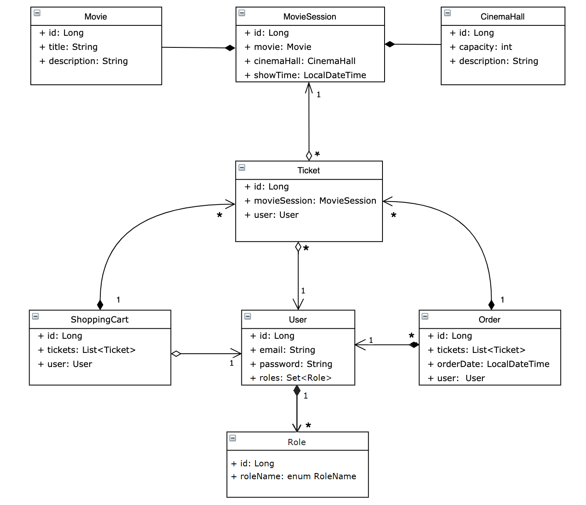

# **Cinema Shop**

A prototype of an online cinema store with basic functionality for users and admins written in Java.

**Project structure**

In this project used N-tier architecture with DB layer, DAO layer, Service layer, Controllers layer.
Project was developed according to SOLID principles with authorization and authentication.

_No role:_

- Registration
- Authorization

_User:_

- View a list of available movies
- View the list of cinema halls
- View order list
- Find session by date
- Add sessions to shopping cart
- Make an order

_Admin:_

- View / add movie
- View / add cinema hall
- Add movie session
- Find session by date
- Find user by email

**Technologies Used**

- Java 14
- Maven 3.1.1
- Maven Checkstyle Plugin
- Hibernate
- Spring 
  + Core
  + MVC 
  + Security
- MySQL RDBMS 
- Apache Tomcat

**Running the Project**

1. Download and install the [JDK]( https://www.oracle.com/ru/java/technologies/javase-downloads.html)
2. Download and install servlet container (for example [Apache Tomcat](https://tomcat.apache.org/download-90.cgi,))
3. Download and install [MySQL Server](https://dev.mysql.com/downloads/)
4. Find file _db.properties_ in resources and change the parameters to yours:
   + url: jdbc:mysql://"host name":"port"/"name db"?serverTimezone=UTC
   + username: "username"
   + password: "password"
5. Run the project.    

**Be careful:**
The admin is created by default. If you want to change parameters for him should do the following: 
1. open _db.properties_ 
2. change parameters to yours:
   + admin.email: "email"
   + admin.password: "password"
